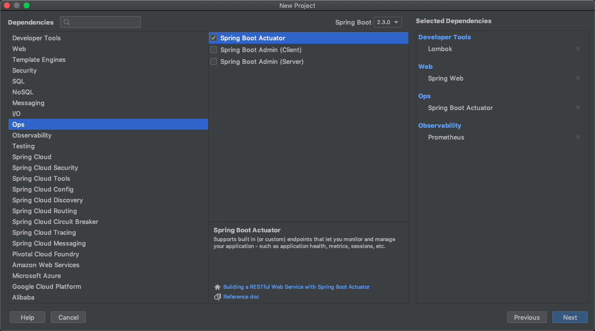
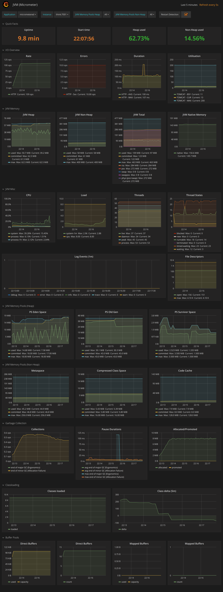

# Spring Boot 接入 Prometheus

---

新建项目，使用以下配置。



已有项目添加以下依赖。

```xml
<dependency>
    <groupId>org.springframework.boot</groupId>
    <artifactId>spring-boot-starter-actuator</artifactId>
</dependency>

<dependency>
    <groupId>io.micrometer</groupId>
    <artifactId>micrometer-registry-prometheus</artifactId>
    <scope>runtime</scope>
</dependency>
```

在`application.properties`中添加以下配置，`spring.application.name`属性必须有，一般为自己项目名称。

```properties
spring.application.name=spring-boot-prometheus-demo

#Metrics related configurations
management.endpoint.metrics.enabled=true
management.endpoints.web.exposure.include=*
management.endpoint.prometheus.enabled=true
management.metrics.export.prometheus.enabled=true
```

启动项目，访问`http://localhost:8080/actuator/prometheus `，看看是否有数据，如果有数据，则表示接入成功。

```text
# HELP jvm_gc_live_data_size_bytes Size of old generation memory pool after a full GC
# TYPE jvm_gc_live_data_size_bytes gauge
jvm_gc_live_data_size_bytes 0.0
# HELP jvm_gc_memory_allocated_bytes_total Incremented for an increase in the size of the young generation memory pool after one GC to before the next
# TYPE jvm_gc_memory_allocated_bytes_total counter
jvm_gc_memory_allocated_bytes_total 0.0
# HELP jvm_buffer_total_capacity_bytes An estimate of the total capacity of the buffers in this pool
# TYPE jvm_buffer_total_capacity_bytes gauge
jvm_buffer_total_capacity_bytes{id="direct",} 12288.0
jvm_buffer_total_capacity_bytes{id="mapped",} 0.0
# HELP jvm_classes_loaded_classes The number of classes that are currently loaded in the Java virtual machine
# TYPE jvm_classes_loaded_classes gauge
jvm_classes_loaded_classes 6672.0
# HELP tomcat_sessions_rejected_sessions_total  
# TYPE tomcat_sessions_rejected_sessions_total counter
tomcat_sessions_rejected_sessions_total 0.0
# HELP process_cpu_usage The "recent cpu usage" for the Java Virtual Machine process
# TYPE process_cpu_usage gauge
process_cpu_usage 0.011122480255509291
# HELP tomcat_sessions_alive_max_seconds  
# TYPE tomcat_sessions_alive_max_seconds gauge
tomcat_sessions_alive_max_seconds 0.0
# HELP jvm_threads_states_threads The current number of threads having NEW state
# TYPE jvm_threads_states_threads gauge
jvm_threads_states_threads{state="runnable",} 12.0
jvm_threads_states_threads{state="blocked",} 0.0
jvm_threads_states_threads{state="waiting",} 12.0
jvm_threads_states_threads{state="timed-waiting",} 3.0
jvm_threads_states_threads{state="new",} 0.0
jvm_threads_states_threads{state="terminated",} 0.0
# HELP jvm_threads_daemon_threads The current number of live daemon threads
# TYPE jvm_threads_daemon_threads gauge
jvm_threads_daemon_threads 23.0
# HELP jvm_buffer_count_buffers An estimate of the number of buffers in the pool
# TYPE jvm_buffer_count_buffers gauge
jvm_buffer_count_buffers{id="direct",} 2.0
jvm_buffer_count_buffers{id="mapped",} 0.0
# HELP process_files_max_files The maximum file descriptor count
# TYPE process_files_max_files gauge
process_files_max_files 10240.0
# HELP jvm_threads_peak_threads The peak live thread count since the Java virtual machine started or peak was reset
# TYPE jvm_threads_peak_threads gauge
jvm_threads_peak_threads 29.0
# HELP jvm_threads_live_threads The current number of live threads including both daemon and non-daemon threads
# TYPE jvm_threads_live_threads gauge
jvm_threads_live_threads 27.0
# HELP jvm_classes_unloaded_classes_total The total number of classes unloaded since the Java virtual machine has started execution
# TYPE jvm_classes_unloaded_classes_total counter
jvm_classes_unloaded_classes_total 1.0
# HELP process_uptime_seconds The uptime of the Java virtual machine
# TYPE process_uptime_seconds gauge
process_uptime_seconds 6.363
# HELP tomcat_sessions_active_max_sessions  
# TYPE tomcat_sessions_active_max_sessions gauge
tomcat_sessions_active_max_sessions 0.0
# HELP tomcat_sessions_active_current_sessions  
# TYPE tomcat_sessions_active_current_sessions gauge
tomcat_sessions_active_current_sessions 0.0
# HELP jvm_gc_memory_promoted_bytes_total Count of positive increases in the size of the old generation memory pool before GC to after GC
# TYPE jvm_gc_memory_promoted_bytes_total counter
jvm_gc_memory_promoted_bytes_total 0.0
# HELP jvm_memory_used_bytes The amount of used memory
# TYPE jvm_memory_used_bytes gauge
jvm_memory_used_bytes{area="heap",id="PS Survivor Space",} 0.0
jvm_memory_used_bytes{area="heap",id="PS Old Gen",} 8435184.0
jvm_memory_used_bytes{area="heap",id="PS Eden Space",} 1.95312144E8
jvm_memory_used_bytes{area="nonheap",id="Metaspace",} 3.2223608E7
jvm_memory_used_bytes{area="nonheap",id="Code Cache",} 9023808.0
jvm_memory_used_bytes{area="nonheap",id="Compressed Class Space",} 4469856.0
# HELP tomcat_sessions_created_sessions_total  
# TYPE tomcat_sessions_created_sessions_total counter
tomcat_sessions_created_sessions_total 0.0
# HELP jvm_gc_max_data_size_bytes Max size of old generation memory pool
# TYPE jvm_gc_max_data_size_bytes gauge
jvm_gc_max_data_size_bytes 1.1453595648E10
# HELP system_load_average_1m The sum of the number of runnable entities queued to available processors and the number of runnable entities running on the available processors averaged over a period of time
# TYPE system_load_average_1m gauge
system_load_average_1m 3.22265625
# HELP jvm_memory_committed_bytes The amount of memory in bytes that is committed for the Java virtual machine to use
# TYPE jvm_memory_committed_bytes gauge
jvm_memory_committed_bytes{area="heap",id="PS Survivor Space",} 4.456448E7
jvm_memory_committed_bytes{area="heap",id="PS Old Gen",} 3.79584512E8
jvm_memory_committed_bytes{area="heap",id="PS Eden Space",} 5.36870912E8
jvm_memory_committed_bytes{area="nonheap",id="Metaspace",} 3.4865152E7
jvm_memory_committed_bytes{area="nonheap",id="Code Cache",} 9043968.0
jvm_memory_committed_bytes{area="nonheap",id="Compressed Class Space",} 4980736.0
# HELP process_start_time_seconds Start time of the process since unix epoch.
# TYPE process_start_time_seconds gauge
process_start_time_seconds 1.5903773701E9
# HELP process_files_open_files The open file descriptor count
# TYPE process_files_open_files gauge
process_files_open_files 93.0
# HELP system_cpu_usage The "recent cpu usage" for the whole system
# TYPE system_cpu_usage gauge
system_cpu_usage 0.05705853418593212
# HELP jvm_memory_max_bytes The maximum amount of memory in bytes that can be used for memory management
# TYPE jvm_memory_max_bytes gauge
jvm_memory_max_bytes{area="heap",id="PS Survivor Space",} 4.456448E7
jvm_memory_max_bytes{area="heap",id="PS Old Gen",} 1.1453595648E10
jvm_memory_max_bytes{area="heap",id="PS Eden Space",} 5.637144576E9
jvm_memory_max_bytes{area="nonheap",id="Metaspace",} -1.0
jvm_memory_max_bytes{area="nonheap",id="Code Cache",} 2.5165824E8
jvm_memory_max_bytes{area="nonheap",id="Compressed Class Space",} 1.073741824E9
# HELP jvm_buffer_memory_used_bytes An estimate of the memory that the Java virtual machine is using for this buffer pool
# TYPE jvm_buffer_memory_used_bytes gauge
jvm_buffer_memory_used_bytes{id="direct",} 12288.0
jvm_buffer_memory_used_bytes{id="mapped",} 0.0
# HELP system_cpu_count The number of processors available to the Java virtual machine
# TYPE system_cpu_count gauge
system_cpu_count 24.0
# HELP logback_events_total Number of error level events that made it to the logs
# TYPE logback_events_total counter
logback_events_total{level="warn",} 0.0
logback_events_total{level="debug",} 0.0
logback_events_total{level="error",} 0.0
logback_events_total{level="trace",} 0.0
logback_events_total{level="info",} 7.0
# HELP tomcat_sessions_expired_sessions_total  
# TYPE tomcat_sessions_expired_sessions_total counter
tomcat_sessions_expired_sessions_total 0.0
```


配置Prometheus。

```yaml
  - job_name: 'spring-boot-prometheus-demo.jvm'
    metrics_path: '/actuator/prometheus'
    static_configs:
      - targets: ["localhost:8081"]
        labels:
          env: 'Prod'
          app: 'spring-boot'
```

然后配置`Grafana`，配置Prometheus数据源，导入ID是`4701`的Dashboard即可，[地址](https://grafana.com/grafana/dashboards/4701)。

效果如下。

